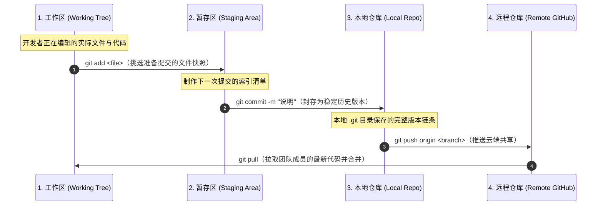

<div class="pt-2 mb-2">
  <h1 class="!border-none !mb-0 text-3xl font-bold">06｜Git 的基本工作模型：四区流转</h1>
  <p class="text-xs text-gray-400 mt-1">代码从键盘输入到最终入驻云端的核心数据流转全景</p>
</div>

<div class="my-auto space-y-4">



<div class="grid grid-cols-4 gap-3 text-xs text-center">
  <div class="p-2.5 bg-blue-500/10 border border-blue-500/30 rounded-xl">
    <div class="font-bold text-blue-400 mb-0.5">工作区</div>
    <div class="opacity-75">肉眼可见的物理文件</div>
  </div>
  <div class="p-2.5 bg-yellow-500/10 border border-yellow-500/30 rounded-xl">
    <div class="font-bold text-yellow-400 mb-0.5">暂存区</div>
    <div class="opacity-75">快照清单与预备购物车</div>
  </div>
  <div class="p-2.5 bg-green-500/10 border border-green-500/30 rounded-xl">
    <div class="font-bold text-green-400 mb-0.5">本地版本库</div>
    <div class="opacity-75">已封存的不可变历史记录</div>
  </div>
  <div class="p-2.5 bg-purple-500/10 border border-purple-500/30 rounded-xl">
    <div class="font-bold text-purple-400 mb-0.5">远程仓库</div>
    <div class="opacity-75">云端协同与团队同步中枢</div>
  </div>
</div>

</div>

---
layout: default
class: flex flex-col h-full
---

<div class="pt-2 mb-2">
  <h1 class="!border-none !mb-0 text-3xl font-bold">07｜Git Repository 是什么？</h1>
</div>

<div class="grid grid-cols-2 gap-8 my-auto">

<div class="space-y-4 flex flex-col justify-center">

<div class="p-5 bg-white/5 border border-white/10 rounded-2xl space-y-2">
  <h3 class="text-lg font-bold !text-gray-900">什么是 Repository（仓库）？</h3>
  <p class="text-xs text-gray-700 leading-relaxed">
    仓库就是一个被 Git 全程托管与监控的<strong>项目工程根目录</strong>。它完整保存了所有源文件、分支指针、提交历史、标签以及全局元数据。
  </p>
</div>

<div class="p-5 bg-blue-500/10 border border-blue-500/25 rounded-2xl text-xs space-y-2">
  <div class="font-bold text-blue-600 flex items-center gap-2 text-sm">
    <svg class="w-4 h-4 text-blue-500 shrink-0" viewBox="0 0 24 24" fill="none" stroke="currentColor" stroke-width="2"><path d="M22 19a2 2 0 0 1-2 2H4a2 2 0 0 1-2-2V5a2 2 0 0 1 2-2h5l2 3h9a2 2 0 0 1 2 2z"/></svg>
    <span>物理形态与底层核心</span>
  </div>
  <p class="text-gray-700 leading-relaxed">
    项目根目录下的隐藏文件夹 <code>.git/</code> 就是整个仓库的大脑与对象数据库。外部的所有源码都只是从 <code>.git/</code> 数据库中临时签出（checkout）的工作拷贝！只要 <code>.git/</code> 还在，哪怕外部源码全被误删，也能瞬间完整复原！
  </p>
</div>

</div>

<div class="p-6 bg-gray-500/10 border border-gray-500/20 rounded-2xl flex flex-col justify-between space-y-3">

<h3 class="text-base font-bold !text-gray-900 flex items-center gap-2">
  <svg class="w-4 h-4 text-purple-500" viewBox="0 0 24 24" fill="none" stroke="currentColor" stroke-width="2"><rect x="2" y="3" width="20" height="14" rx="2" ry="2"/><line x1="8" y1="21" x2="16" y2="21"/><line x1="12" y1="17" x2="12" y2="21"/></svg>
  <span>仓库的两种存在形态与流转</span>
</h3>

<div class="space-y-2.5 text-xs">
  <div class="p-3 bg-white/5 border border-white/10 rounded-xl space-y-1">
    <div class="font-bold text-blue-600 flex items-center justify-between">
      <span>本地仓库 (Local Repository)</span>
      <span class="text-[11px] font-mono text-gray-500">个人电脑 · 离线全功能</span>
    </div>
    <div class="text-gray-700 leading-relaxed">包含完整的 <code>.git/</code> 数据库。可独立进行毫秒级 Commit 快照、自由切换分支与版本回退。</div>
  </div>

  <div class="flex items-center justify-center gap-4 py-1 text-xs font-mono">
    <div class="flex items-center gap-1 text-emerald-600 font-bold">
      <span>git push</span>
    </div>
    <div class="w-20 border-t border-dashed border-gray-300"></div>
    <div class="flex items-center gap-1 text-blue-600 font-bold">
      <span>git pull</span>
    </div>
  </div>

  <div class="p-3 bg-white/5 border border-white/10 rounded-xl space-y-1">
    <div class="font-bold text-purple-600 flex items-center justify-between">
      <span>远程仓库 (Remote Repository)</span>
      <span class="text-[11px] font-mono text-gray-500">云端托管 · 协同基准源</span>
    </div>
    <div class="text-gray-700 leading-relaxed">部署于 GitHub / GitLab，作为团队<strong>唯一事实基准源</strong>，承载代码审查 (PR)、持续集成与资产灾备。</div>
  </div>
</div>

</div>

</div>

---
layout: default
class: flex flex-col h-full
---

<div class="pt-2 mb-2">
  <h1 class="!border-none !mb-0 text-3xl font-bold">08｜认识一个 GitHub 项目全景</h1>
  <p class="text-xs text-gray-400 mt-1">进入任何主流开源项目页面（如 Vue 或 FastAPI）必须掌握的八大核心看板</p>
</div>

<div class="grid grid-cols-4 gap-4 my-auto text-xs">

<div class="p-4 bg-gray-500/10 border border-gray-500/20 rounded-xl space-y-1.5 flex flex-col justify-between">
  <div>
    <div class="font-bold text-blue-400 mb-1 flex items-center gap-1.5 text-sm">
      <svg class="w-4 h-4 text-blue-400" viewBox="0 0 24 24" fill="none" stroke="currentColor" stroke-width="2"><path d="M14 2H6a2 2 0 0 0-2 2v16a2 2 0 0 0 2 2h12a2 2 0 0 0 2-2V8z"/><polyline points="14 2 14 8 20 8"/></svg>
      <span>README.md</span>
    </div>
    <p class="opacity-80 leading-relaxed">项目的官方说明书。包含架构简介、安装命令、快速上手指南与徽章状态。</p>
  </div>
</div>

<div class="p-4 bg-gray-500/10 border border-gray-500/20 rounded-xl space-y-1.5 flex flex-col justify-between">
  <div>
    <div class="font-bold text-green-400 mb-1 flex items-center gap-1.5 text-sm">
      <svg class="w-4 h-4 text-green-400" viewBox="0 0 24 24" fill="none" stroke="currentColor" stroke-width="2"><circle cx="12" cy="12" r="10"/><line x1="12" y1="8" x2="12" y2="12"/><line x1="12" y1="16" x2="12.01" y2="16"/></svg>
      <span>Issues (工单)</span>
    </div>
    <p class="opacity-80 leading-relaxed">缺陷汇报与需求征集看板。遇到技术疑难杂症，优先在这里通过关键词搜索历史解答。</p>
  </div>
</div>

<div class="p-4 bg-gray-500/10 border border-gray-500/20 rounded-xl space-y-1.5 flex flex-col justify-between">
  <div>
    <div class="font-bold text-purple-400 mb-1 flex items-center gap-1.5 text-sm">
      <svg class="w-4 h-4 text-purple-400" viewBox="0 0 24 24" fill="none" stroke="currentColor" stroke-width="2"><circle cx="18" cy="18" r="3"/><circle cx="6" cy="6" r="3"/><path d="M13 6h3a2 2 0 0 1 2 2v7"/><line x1="6" y1="9" x2="6" y2="21"/></svg>
      <span>Pull Requests</span>
    </div>
    <p class="opacity-80 leading-relaxed">等待合并的代码贡献通道。可直观审查其他人为该项目正在提交哪些前沿特性与补丁。</p>
  </div>
</div>

<div class="p-4 bg-gray-500/10 border border-gray-500/20 rounded-xl space-y-1.5 flex flex-col justify-between">
  <div>
    <div class="font-bold text-yellow-400 mb-1 flex items-center gap-1.5 text-sm">
      <svg class="w-4 h-4 text-yellow-400" viewBox="0 0 24 24" fill="none" stroke="currentColor" stroke-width="2"><path d="M21 16V8a2 2 0 0 0-1-1.73l-7-4a2 2 0 0 0-2 0l-7 4A2 2 0 0 0 3 8v8a2 2 0 0 0 1 1.73l7 4a2 2 0 0 0 2 0l7-4A2 2 0 0 0 21 16z"/></svg>
      <span>Releases</span>
    </div>
    <p class="opacity-80 leading-relaxed">正式发布的稳定版本（如 v2.1.0），包含编译打包成品（Assets）与详细版本更新日志。</p>
  </div>
</div>

<div class="p-4 bg-gray-500/10 border border-gray-500/20 rounded-xl space-y-1.5 flex flex-col justify-between">
  <div>
    <div class="font-bold text-pink-400 mb-1 flex items-center gap-1.5 text-sm">
      <svg class="w-4 h-4 text-pink-400" viewBox="0 0 24 24" fill="none" stroke="currentColor" stroke-width="2"><line x1="6" y1="3" x2="6" y2="15"/><circle cx="18" cy="6" r="3"/><circle cx="6" cy="18" r="3"/><path d="M18 9a9 9 0 0 1-9 9"/></svg>
      <span>Branches</span>
    </div>
    <p class="opacity-80 leading-relaxed">项目演进分支。通常 <code>main</code> 是基线稳定代码，<code>dev</code> 或 <code>next</code> 是下一代激进开发分支。</p>
  </div>
</div>

<div class="p-4 bg-gray-500/10 border border-gray-500/20 rounded-xl space-y-1.5 flex flex-col justify-between">
  <div>
    <div class="font-bold text-indigo-400 mb-1 flex items-center gap-1.5 text-sm">
      <svg class="w-4 h-4 text-indigo-400" viewBox="0 0 24 24" fill="none" stroke="currentColor" stroke-width="2"><rect x="3" y="11" width="18" height="11" rx="2" ry="2"/><path d="M7 11V7a5 5 0 0 1 10 0v4"/></svg>
      <span>License</span>
    </div>
    <p class="opacity-80 leading-relaxed">开源法律授权许可。决定你是否能商业使用、能否修改代码闭源以及是否具备专利免责。</p>
  </div>
</div>

<div class="p-4 bg-gray-500/10 border border-gray-500/20 rounded-xl space-y-1.5 flex flex-col justify-between">
  <div>
    <div class="font-bold text-amber-400 mb-1 flex items-center gap-1.5 text-sm">
      <svg class="w-4 h-4 text-amber-400" viewBox="0 0 24 24" fill="currentColor"><polygon points="12 2 15.09 8.26 22 9.27 17 14.14 18.18 21.02 12 17.77 5.82 21.02 7 14.14 2 9.27 8.91 8.26 12 2"/></svg>
      <span>Star</span>
    </div>
    <p class="opacity-80 leading-relaxed">全球开发者的点赞收藏指标。衡量项目人气、生态健康度与行业流行度的关键风向标。</p>
  </div>
</div>

<div class="p-4 bg-gray-500/10 border border-gray-500/20 rounded-xl space-y-1.5 flex flex-col justify-between">
  <div>
    <div class="font-bold text-cyan-400 mb-1 flex items-center gap-1.5 text-sm">
      <svg class="w-4 h-4 text-cyan-400" viewBox="0 0 24 24" fill="none" stroke="currentColor" stroke-width="2"><circle cx="12" cy="18" r="3"/><circle cx="6" cy="6" r="3"/><circle cx="18" cy="6" r="3"/><path d="M18 9v2a2 2 0 0 1-2 2H8a2 2 0 0 1-2-2V9"/><line x1="12" y1="13" x2="12" y2="15"/></svg>
      <span>Fork</span>
    </div>
    <p class="opacity-80 leading-relaxed">克隆整个项目到个人账号。获得全权读写能力，为后续向作者提交 PR 贡献代码打底。</p>
  </div>
</div>

</div>

---
layout: default
class: flex flex-col h-full
---

<div class="pt-2 mb-2">
  <h1 class="!border-none !mb-0 text-3xl font-bold">09｜如何寻找并鉴别优质开源项目？</h1>
</div>

<div class="grid grid-cols-2 gap-8 my-auto">

<div class="space-y-4">

<h3 class="flex items-center gap-2 text-base font-bold">
  <svg class="w-5 h-5 text-blue-500" viewBox="0 0 24 24" fill="none" stroke="currentColor" stroke-width="2"><circle cx="11" cy="11" r="8"/><line x1="21" y1="21" x2="16.65" y2="16.65"/></svg>
  <span class="!text-gray-900">5 维健康度综合评估雷达</span>
</h3>

<div class="space-y-2.5 text-xs text-gray-700">
  <div class="p-3 bg-white/5 border border-white/10 rounded-xl flex items-start gap-2.5">
    <strong class="text-blue-600 shrink-0">1. 提交活跃度</strong>
    <span>查看最近一次 Commit 时间是近一个月内，还是两年前已实质停滞？</span>
  </div>
  <div class="p-3 bg-white/5 border border-white/10 rounded-xl flex items-start gap-2.5">
    <strong class="text-blue-600 shrink-0">2. 发版节奏</strong>
    <span>是否遵循语义化版本号（SemVer），并按季度/月度发布正式 Release？</span>
  </div>
  <div class="p-3 bg-white/5 border border-white/10 rounded-xl flex items-start gap-2.5">
    <strong class="text-blue-600 shrink-0">3. 响应周期</strong>
    <span>Issue / PR 关闭率是否高于 80%？作者与核心维护者是否活跃交流？</span>
  </div>
  <div class="p-3 bg-white/5 border border-white/10 rounded-xl flex items-start gap-2.5">
    <strong class="text-blue-600 shrink-0">4. 工程质量</strong>
    <span>文档完备度如何？单元测试覆盖率是否充足？是否有 CI 自动化通行徽章？</span>
  </div>
  <div class="p-3 bg-white/5 border border-white/10 rounded-xl flex items-start gap-2.5">
    <strong class="text-blue-600 shrink-0">5. Star数量</strong>
    <span>Star 高只代表营销成功，真实可用性必须结合前 4 项工程指标综合决断。</span>
  </div>
</div>

</div>

<div class="space-y-3.5 flex flex-col justify-center">

<div class="p-4.5 bg-red-500/10 border border-red-500/25 rounded-2xl text-xs space-y-2">
  <div class="text-red-500 font-bold flex items-center gap-2 text-sm">
    <svg class="w-4 h-4" viewBox="0 0 24 24" fill="none" stroke="currentColor" stroke-width="2"><circle cx="12" cy="12" r="10"/><line x1="4.93" y1="4.93" x2="19.07" y2="19.07"/></svg>
    <span>危险项目</span>
  </div>
  <div class="text-gray-700 space-y-1 leading-relaxed">
    <div>• 最新 Commit 距离现在超过 2 年，堆积了数百个无人过问的 Open Issues。</div>
    <div>• README 只有一两句说明，缺失安装依赖与运行排错指引。</div>
    <div>• 无任何 License（法律上默认保留所有权利，严禁商业引入！）。</div>
  </div>
</div>

<div class="p-4.5 bg-emerald-500/10 border border-emerald-500/25 rounded-2xl text-xs space-y-2">
  <div class="text-emerald-600 font-bold flex items-center gap-2 text-sm">
    <svg class="w-4 h-4" viewBox="0 0 24 24" fill="none" stroke="currentColor" stroke-width="2"><polyline points="20 6 9 17 4 12"/></svg>
    <span>优质项目</span>
  </div>
  <div class="text-gray-700 space-y-1 leading-relaxed">
    <div>• 维护活跃度持续平稳，CI/CD 流水线常绿无阻。</div>
    <div>• 提供详细的 CHANGELOG 与迁移指南，测试用例健全规范。</div>
    <div>• 社区回应友善积极，拥有完备的贡献者行为准则。</div>
  </div>
</div>

</div>

</div>

---
layout: default
class: flex flex-col h-full
---

<div class="pt-2 mb-2">
  <h1 class="!border-none !mb-0 text-3xl font-bold">10｜GitHub License：不可忽视的法律红线</h1>
  <p class="text-xs text-gray-400 mt-1">“开源”绝非等于“公共领域（Public Domain）”，更不等于可以随意商用闭源</p>
</div>

<div class="my-auto space-y-5">

<div class="grid grid-cols-4 gap-4 text-xs">

<div class="p-4.5 bg-green-500/10 border border-green-500/30 rounded-2xl flex flex-col h-full justify-between">
  <div class="flex-1">
    <div class="text-sm font-bold text-green-600 mb-2">MIT License</div>
    <div class="text-gray-700 space-y-1.5 leading-relaxed">
      <div>• <strong>极度宽松自由</strong></div>
      <div>• 允许商业使用与修改闭源</div>
      <div>• 唯一义务：保留原作者版权声明</div>
    </div>
  </div>
  <div class="text-xs text-green-700 font-mono pt-2.5 mt-3 border-t border-green-500/25 shrink-0">
    代表：Vue, React
  </div>
</div>

<div class="p-4.5 bg-blue-500/10 border border-blue-500/30 rounded-2xl flex flex-col h-full justify-between">
  <div class="flex-1">
    <div class="text-sm font-bold text-blue-600 mb-2">Apache-2.0</div>
    <div class="text-gray-700 space-y-1.5 leading-relaxed">
      <div>• <strong>企业级工业首选</strong></div>
      <div>• 允许商用，明确授予<strong>专利授权</strong></div>
      <div>• 必须对修改过的文件做明确声明</div>
    </div>
  </div>
  <div class="text-xs text-blue-700 font-mono pt-2.5 mt-3 border-t border-blue-500/25 shrink-0">
    代表：Kubernetes, TF
  </div>
</div>

<div class="p-4.5 bg-yellow-500/10 border border-yellow-500/30 rounded-2xl flex flex-col h-full justify-between">
  <div class="flex-1">
    <div class="text-sm font-bold text-yellow-600 mb-2">BSD (2/3-Clause)</div>
    <div class="text-gray-700 space-y-1.5 leading-relaxed">
      <div>• <strong>与 MIT 类似宽松</strong></div>
      <div>• 允许商业闭源交付与再分发</div>
      <div>• 禁止用原作者姓名做商业推广</div>
    </div>
  </div>
  <div class="text-xs text-yellow-700 font-mono pt-2.5 mt-3 border-t border-yellow-500/25 shrink-0">
    代表：Flask, Go, Nginx
  </div>
</div>

<div class="p-4.5 bg-red-500/10 border border-red-500/30 rounded-2xl flex flex-col h-full justify-between">
  <div class="flex-1">
    <div class="text-sm font-bold text-red-600 mb-2">GPL v3 (强传染性)</div>
    <div class="text-gray-700 space-y-1.5 leading-relaxed">
      <div>• <strong>强开源保护协议</strong></div>
      <div>• 任何链接/修改，<strong>全项目必须开源</strong></div>
      <div>• 商业闭源软件务必严防死守</div>
    </div>
  </div>
  <div class="text-xs text-red-700 font-mono pt-2.5 mt-3 border-t border-red-500/25 shrink-0">
    代表：Linux Kernel (v2)
  </div>
</div>

</div>

<div class="p-3.5 bg-red-500/15 border border-red-500/30 text-xs rounded-xl text-center flex items-center justify-center gap-2">
  <svg class="w-4 h-4 text-red-400 shrink-0" viewBox="0 0 24 24" fill="none" stroke="currentColor" stroke-width="2"><path d="M10.29 3.86L1.82 18a2 2 0 0 0 1.71 3h16.94a2 2 0 0 0 1.71-3L13.71 3.86a2 2 0 0 0-3.42 0z"/><line x1="12" y1="9" x2="12" y2="13"/><line x1="12" y1="17" x2="12.01" y2="17"/></svg>
  <span><strong>商业合规生死线</strong>：引入任何第三方开源库到公司项目前，务必先看其 License 是否侵犯闭源商业利益！</span>
</div>

</div>

---
layout: default
class: flex flex-col h-full
---

<div class="pt-2 mb-2">
  <h1 class="!border-none !mb-0 text-3xl font-bold">11｜获取 GitHub 项目的三种方式</h1>
</div>

<div class="grid grid-cols-3 gap-6 my-auto">

<div class="p-6 bg-gray-500/10 border border-gray-500/20 rounded-2xl flex flex-col justify-between space-y-4">
  <div>
    <div class="text-base font-bold text-yellow-400 mb-3 flex items-center gap-2">
      <svg class="w-5 h-5" viewBox="0 0 24 24" fill="none" stroke="currentColor" stroke-width="2"><path d="M21 15v4a2 2 0 0 1-2 2H5a2 2 0 0 1-2-2v-4"/><polyline points="7 10 12 15 17 10"/><line x1="12" y1="15" x2="12" y2="3"/></svg>
      <span>1. Download ZIP</span>
    </div>
    <div class="text-xs space-y-2 text-gray-300 leading-relaxed">
      <p>• <strong>操作流程</strong>：点击绿色「Code」按钮 $\rightarrow$ Download ZIP 压缩包。</p>
      <p>• <strong>底层特征</strong>：只是某一刻的纯静态快照，<strong>不包含任何 <code>.git</code> 历史与分支</strong>。</p>
      <p>• <strong>适用场景</strong>：非研发人员临时查阅文档、快速单次复制代码素材。</p>
    </div>
  </div>
  <div class="text-xs font-mono text-yellow-300 bg-yellow-500/10 p-2 rounded-lg text-center">
    无法同步远程未来更新
  </div>
</div>

<div class="p-6 bg-blue-500/10 border border-blue-500/20 rounded-2xl flex flex-col justify-between space-y-4">
  <div>
    <div class="text-base font-bold text-blue-400 mb-3 flex items-center gap-2">
      <svg class="w-5 h-5" viewBox="0 0 24 24" fill="none" stroke="currentColor" stroke-width="2"><polyline points="16 18 22 12 16 6"/><polyline points="8 6 2 12 8 18"/></svg>
      <span>2. git clone</span>
    </div>
    <div class="text-xs space-y-2 text-gray-300 leading-relaxed">
      <p>• <strong>操作流程</strong>：复制 HTTPS/SSH 地址执行 <code>git clone &lt;url&gt;</code>。</p>
      <p>• <strong>底层特征</strong>：拉取包含 <code>.git</code> 在内的全部版本链条，随时可 <code>git pull</code> <strong>一键追更</strong>。</p>
      <p>• <strong>适用场景</strong>：长期使用该开源项目、本地源码级二次开发与研究。</p>
    </div>
  </div>
  <div class="text-xs font-mono text-blue-300 bg-blue-500/10 p-2 rounded-lg text-center">
    开发人员最标准的获取方式
  </div>
</div>

<div class="p-6 bg-emerald-500/10 border border-emerald-500/20 rounded-2xl flex flex-col justify-between space-y-4">
  <div>
    <div class="text-base font-bold text-emerald-400 mb-3 flex items-center gap-2">
      <svg class="w-5 h-5" viewBox="0 0 24 24" fill="none" stroke="currentColor" stroke-width="2"><circle cx="12" cy="18" r="3"/><circle cx="6" cy="6" r="3"/><circle cx="18" cy="6" r="3"/><path d="M18 9v2a2 2 0 0 1-2 2H8a2 2 0 0 1-2-2V9"/><line x1="12" y1="13" x2="12" y2="15"/></svg>
      <span>3. Fork + git clone</span>
    </div>
    <div class="text-xs space-y-2 text-gray-300 leading-relaxed">
      <p>• <strong>操作流程</strong>：在 GitHub 点击 Fork 复制到个人名下，再 Clone 个人仓库。</p>
      <p>• <strong>底层特征</strong>：拥有 100% 独立写权限，可直接 Push 并向官方发起 Pull Request。</p>
      <p>• <strong>适用场景</strong>：参与开源项目贡献、定制维护企业内部专用私有衍生版。</p>
    </div>
  </div>
  <div class="text-xs font-mono text-emerald-600 bg-emerald-500/10 p-2 rounded-lg text-center">
    开源贡献者必经之路
  </div>
</div>

</div>

---
layout: default
class: flex flex-col h-full
---

<div class="pt-2 mb-2">
  <h1 class="!border-none !mb-0 text-3xl font-bold">12-1｜实战：第一次 Clone 项目（前端生态）</h1>
</div>

<div class="grid grid-cols-2 gap-8 my-auto">

<div class="space-y-4">

<h3 class="text-base font-bold text-blue-400">第一步：拉取源码与目录进入</h3>

```bash
# 1. 复制 HTTPS 或 SSH 地址进行全量克隆
git clone https://github.com/vitejs/vite.git
# 或通过 SSH 协议克隆:git clone git@github.com:vitejs/vite.git

# 2. 进入本地工程根目录
cd vite

# 3. 检查当前本地分支与代码状态
git status
```

<div class="p-3.5 bg-white/5 border border-white/10 rounded-xl text-xs text-gray-300 leading-relaxed">
  <strong>提示</strong>：无论使用命令行、VS Code 还是 WebStorm，第一步永远是确认仓库已完整下载并具备 <code>.git</code> 目录。
</div>

</div>

<div class="space-y-4">

<h3 class="text-base font-bold text-green-400">第二步：依赖安装与热重载启动</h3>

```bash
# 4. 查阅 README.md 确认项目指定的包管理工具
# (npm / pnpm / yarn / bun)

# 5. 安装全部运行与编译依赖 (本地生成 node_modules)
pnpm install
# 或执行: npm install / bun install

# 6. 启动本地开发服务 (支持实时热重载 HMR)
npm run dev
# 或执行: pnpm dev / bun run dev
```

<div class="p-3.5 bg-blue-500/10 border border-blue-500/20 rounded-xl text-xs text-blue-400 leading-relaxed">
  <strong>核心认知</strong>：<code>node_modules</code> 依赖目录体积庞大，已被 <code>.gitignore</code> 排除，Clone 之后必须手动执行一次安装命令！
</div>

</div>

</div>

---
layout: default
class: flex flex-col h-full
---

<div class="pt-2 mb-2">
  <h1 class="!border-none !mb-0 text-3xl font-bold">12-2｜实战：第一次 Clone 项目（Python 生态）</h1>
</div>

<div class="grid grid-cols-2 gap-8 my-auto">

<div class="space-y-4">

<h3 class="text-base font-bold text-blue-400">第一步：拉取仓库与虚拟环境隔离</h3>

```bash
# 1. 克隆目标仓库
git clone https://github.com/tiangolo/fastapi.git
cd fastapi

# 2. 强烈建议：创建项目独立的虚拟运行环境
python -m venv .venv

# 3. 激活虚拟环境
# Windows PowerShell 环境:
.\.venv\Scripts\Activate.ps1
# Linux / macOS 终端环境:
source .venv/bin/activate
```

<div class="p-3.5 bg-white/5 border border-white/10 rounded-xl text-xs text-gray-300 leading-relaxed">
  <strong>避坑关键</strong>：不要在全局系统 Python 中直接 <code>pip install</code>，避免不同项目的依赖包版本冲突污染全局环境！
</div>

</div>

<div class="space-y-4">

<h3 class="text-base font-bold text-green-400">第二步：依赖解析与接口启动</h3>

```bash
# 4. 根据项目配置文件安装依赖包:
# 传统项目 (基于 requirements.txt):
pip install -r requirements.txt

# 现代化工程体系 (基于 poetry / uv / pdm):
poetry install
# 或使用下一代极速包管理器: uv sync

# 5. 启动服务或运行单元测试
uvicorn main:app --reload
# 或执行脚本: python main.py
```

<div class="p-3.5 bg-emerald-500/10 border border-emerald-500/20 rounded-xl text-xs text-emerald-600 leading-relaxed">
  <strong>最佳实践</strong>：激活虚拟环境后，终端命令行左侧通常会显示 <code>(.venv)</code> 前缀，代表环境已处于安全隔离状态。
</div>

</div>

</div>

---
layout: default
class: flex flex-col h-full
---

<div class="pt-2 mb-2">
  <h1 class="!border-none !mb-0 text-3xl font-bold">13｜项目更新后如何同步？</h1>
  <p class="text-xs text-gray-400 mt-1">拉取远程最新代码的两种核心命令与底层差异</p>
</div>

<div class="grid grid-cols-2 gap-8 my-auto">

<div class="space-y-3 flex flex-col justify-center">

<h3 class="text-base font-bold !text-gray-900 flex items-center gap-2">
  <svg class="w-4 h-4 text-blue-500" viewBox="0 0 24 24" fill="none" stroke="currentColor" stroke-width="2"><polyline points="16 16 12 12 8 16"/><line x1="12" y1="12" x2="12" y2="21"/><path d="M20.39 18.39A5 5 0 0 0 18 9h-1.26A8 8 0 1 0 3 16.3"/></svg>
  <span><code>git fetch</code> vs <code>git pull</code>：机制对比</span>
</h3>

<div class="space-y-2.5 text-xs">
  <div class="p-3 bg-white/5 border border-white/10 rounded-xl space-y-1.5">
    <div class="flex items-center justify-between font-bold text-blue-600">
      <span>模式 A：<code>git fetch</code>（先探查，后合并）</span>
      <span class="text-[11px] font-mono text-gray-500">零侵入安全流</span>
    </div>
    <div class="text-gray-700 leading-relaxed">
      云端最新 Commit 仅下载到本地的 <code>origin/main</code> 镜像分支，<strong>当前工作区代码完全不受影响</strong>，可随时通过 <code>git log</code> 比对审阅。
    </div>
  </div>

  <div class="p-3 bg-white/5 border border-white/10 rounded-xl space-y-1.5">
    <div class="flex items-center justify-between font-bold text-emerald-600">
      <span>模式 B：<code>git pull</code>（直接合入工作区）</span>
      <span class="text-[11px] font-mono text-gray-500">单步快连流</span>
    </div>
    <div class="text-gray-700 leading-relaxed">
      <strong>核心本质</strong>：<code>git pull = git fetch + git merge</code>。<br/>
      直接将云端提交强行合并入本地当前分支，一旦本地有重叠改动将立即引发冲突。
    </div>
  </div>
</div>

</div>

<div class="p-6 bg-gray-500/10 border border-gray-500/20 rounded-2xl flex flex-col justify-between space-y-4">

<h3 class="text-base font-bold !text-gray-900 flex items-center gap-2">

  <span>同步更新的黄金实践准则</span>
</h3>

```bash
# 稳妥实践方式（推荐团队开发采用）：
git fetch origin
git status  # 检查当前分支落后了几个 commit
git merge origin/main

# 快捷单步方式（确保本地无未提交草稿时）：
git pull origin main
```

<div class="p-4 bg-yellow-500/10 border border-yellow-500/30 text-xs rounded-xl leading-relaxed">
在拉取云端更新之前，务必通过 <code>git status</code> 确保本地工作区处于干净状态（无未提交的草稿改动），能规避 95% 的恶性代码合并冲突！
</div>

</div>

</div>
