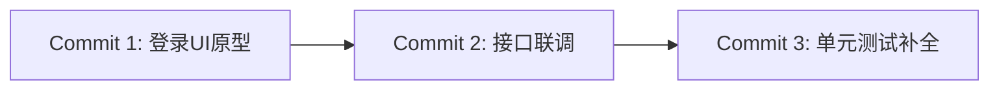
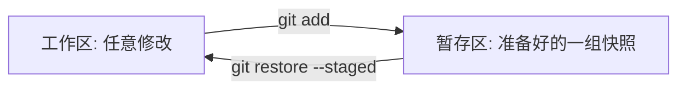

<div class="pt-2 mb-2">
  <h1 class="!border-none !mb-0 text-3xl font-bold">14｜Git 最核心的六大概念</h1>
  <p class="text-xs text-gray-400 mt-1">无需死记繁杂参数，建立起这六大心智模型，Git 命令便会水到渠成</p>
</div>

<div class="grid grid-cols-3 gap-5 my-auto text-xs">

<div class="p-5 bg-blue-500/10 border border-blue-500/25 rounded-2xl flex flex-col justify-between space-y-2">
  <div>
    <div class="text-sm font-bold text-blue-400 mb-1 flex items-center gap-2">
      <svg class="w-4 h-4" viewBox="0 0 24 24" fill="none" stroke="currentColor" stroke-width="2"><circle cx="12" cy="12" r="4"/><line x1="1.05" y1="12" x2="7" y2="12"/><line x1="17.01" y1="12" x2="22.96" y2="12"/></svg>
      <span>Commit（提交快照）</span>
    </div>
    <p class="opacity-80 leading-relaxed text-gray-300">Git 的最小版本原子。每次提交生成一个唯一的 SHA-1 哈希值，不可变地固化当前工程快照。</p>
  </div>
</div>

<div class="p-5 bg-emerald-500/10 border border-emerald-500/25 rounded-2xl flex flex-col justify-between space-y-2">
  <div>
    <div class="text-sm font-bold text-emerald-400 mb-1 flex items-center gap-2">
      <svg class="w-4 h-4" viewBox="0 0 24 24" fill="none" stroke="currentColor" stroke-width="2"><line x1="6" y1="3" x2="6" y2="15"/><circle cx="18" cy="6" r="3"/><circle cx="6" cy="18" r="3"/><path d="M18 9a9 9 0 0 1-9 9"/></svg>
      <span>Branch（分支指针）</span>
    </div>
    <p class="opacity-80 leading-relaxed text-gray-300">指向某个特定 Commit 的轻量级移动指针。创建分支仅耗时几毫秒，开辟并行实验舱。</p>
  </div>
</div>

<div class="p-5 bg-purple-500/10 border border-purple-500/25 rounded-2xl flex flex-col justify-between space-y-2">
  <div>
    <div class="text-sm font-bold text-purple-400 mb-1 flex items-center gap-2">
      <svg class="w-4 h-4" viewBox="0 0 24 24" fill="none" stroke="currentColor" stroke-width="2"><circle cx="12" cy="12" r="10"/><polygon points="16.24 7.76 14.12 14.12 7.76 16.24 9.88 9.88 16.24 7.76"/></svg>
      <span>HEAD（当前指针）</span>
    </div>
    <p class="opacity-80 leading-relaxed text-gray-300">指向你“当前工作区所处分支或提交”的全局指针。指示你目前漫游在哪个代码时空。</p>
  </div>
</div>

<div class="p-5 bg-yellow-500/10 border border-yellow-500/25 rounded-2xl flex flex-col justify-between space-y-2">
  <div>
    <div class="text-sm font-bold text-yellow-400 mb-1 flex items-center gap-2">
      <svg class="w-4 h-4" viewBox="0 0 24 24" fill="none" stroke="currentColor" stroke-width="2"><circle cx="12" cy="12" r="10"/><line x1="2" y1="12" x2="22" y2="12"/><path d="M12 2a15.3 15.3 0 0 1 4 10 15.3 15.3 0 0 1-4 10 15.3 15.3 0 0 1-4-10 15.3 15.3 0 0 1 4-10z"/></svg>
      <span>Remote（远程主机）</span>
    </div>
    <p class="opacity-80 leading-relaxed text-gray-300">托管在云端的仓库镜像别名（如 <code>origin</code>），是多人分布式协同与同步的核心中转站。</p>
  </div>
</div>

<div class="p-5 bg-pink-500/10 border border-pink-500/25 rounded-2xl flex flex-col justify-between space-y-2">
  <div>
    <div class="text-sm font-bold text-pink-400 mb-1 flex items-center gap-2">
      <svg class="w-4 h-4" viewBox="0 0 24 24" fill="none" stroke="currentColor" stroke-width="2"><circle cx="18" cy="18" r="3"/><circle cx="6" cy="6" r="3"/><path d="M6 21V9a9 9 0 0 0 9 9"/></svg>
      <span>Merge（合并分叉）</span>
    </div>
    <p class="opacity-80 leading-relaxed text-gray-300">将两个独立演进分支的历史改动合二为一，产生融合两方成果的新合并节点。</p>
  </div>
</div>

<div class="p-5 bg-cyan-500/10 border border-cyan-500/25 rounded-2xl flex flex-col justify-between space-y-2">
  <div>
    <div class="text-sm font-bold text-cyan-400 mb-1 flex items-center gap-2">
      <svg class="w-4 h-4" viewBox="0 0 24 24" fill="none" stroke="currentColor" stroke-width="2"><path d="M20.59 13.41l-7.17 7.17a2 2 0 0 1-2.83 0L2 12V2h10l8.59 8.59a2 2 0 0 1 0 2.82z"/><line x1="7" y1="7" x2="7.01" y2="7"/></svg>
      <span>Tag（版本里程碑）</span>
    </div>
    <p class="opacity-80 leading-relaxed text-gray-300">指向特定重大版本的只读不可移动标签（如 <code>v1.0.0</code>），用于正式发版生产归档。</p>
  </div>
</div>

</div>

---
layout: default
class: flex flex-col h-full
---

<div class="pt-2 mb-2">
  <h1 class="!border-none !mb-0 text-3xl font-bold">15｜Commit 是什么？</h1>
</div>

<div class="grid grid-cols-2 gap-8 my-auto">

<div class="space-y-4 flex flex-col justify-center">

<div class="p-5 bg-white/5 border border-white/10 rounded-2xl space-y-2">
  <h3 class="text-lg font-bold text-blue-400">时间线上的完整状态快照</h3>
  <p class="text-xs text-gray-300 leading-relaxed">
    一个 Commit 绝不仅仅记录改动了哪几行，而是记录了工程在特定时间点的<strong>全部目录树快照</strong>。
  </p>
  <div class="space-y-1.5 text-xs text-gray-400 pt-1">
    <div>• <strong>40 位不可变 SHA-1 哈希</strong>：全局唯一身份凭证。</div>
    <div>• <strong>作者元数据</strong>：提交者姓名、邮箱与精确时间戳。</div>
    <div>• <strong>父节点引用</strong>：指向前驱 Commit，形成版本时光长河。</div>
    <div>• <strong>提交说明（Message）</strong>：阐述改动原因与上下文。</div>
  </div>
</div>

</div>

<div class="p-6 bg-gray-500/10 border border-gray-500/20 rounded-2xl flex flex-col justify-between space-y-4">

<h3 class="text-base font-bold text-emerald-400 flex items-center gap-2">
  <svg class="w-5 h-5" viewBox="0 0 24 24" fill="none" stroke="currentColor" stroke-width="2"><circle cx="12" cy="12" r="10"/><path d="M12 8v8"/><path d="M8 12h8"/></svg>
  <span>良好 Commit 的工程准则</span>
</h3>



<div class="space-y-2 text-xs text-gray-300">
  <div class="p-2.5 bg-white/5 rounded-xl border border-white/10 leading-relaxed">
    <strong>原子性原则（Atomic Commit）</strong>：一个 Commit 只做一件完整事情，严禁将“修复Bug + 顺手格式化全项目 80 个文件”混合提交。
  </div>
  <div class="p-2.5 bg-white/5 rounded-xl border border-white/10 leading-relaxed">
    <strong>可构建原则</strong>：确保每一个 Commit 都是可编译通过的稳定状态，便于日后通过 <code>git bisect</code> 自动化二分回溯线上问题。
  </div>
</div>

</div>

</div>

---
layout: default
class: flex flex-col h-full
---

<div class="pt-2 mb-2">
  <h1 class="!border-none !mb-0 text-3xl font-bold">16｜查看 Git 当前状态：'git status'</h1>
</div>

<div class="grid grid-cols-2 gap-8 my-auto">

<div class="space-y-4 flex flex-col justify-center">

<div class="p-5 bg-white/5 border border-white/10 rounded-2xl space-y-3">
  <h3 class="text-lg font-bold text-blue-400">开发过程中使用频率最高的透视镜</h3>
  <p class="text-xs text-gray-300 leading-relaxed">
    遇到任何意料之外的 Git 疑问，第一直觉永远是运行 <code>git status</code>。它能精准指出当前各文件处于哪个生命周期阶段。
  </p>
  <div class="space-y-2 text-xs pt-1">
    <div class="flex items-center gap-2 text-emerald-400">
      <div class="w-2.5 h-2.5 rounded-full bg-emerald-400"></div>
      <strong>Changes to be committed（绿色）</strong>：已就绪，随时可 commit。
    </div>
    <div class="flex items-center gap-2 text-rose-400">
      <div class="w-2.5 h-2.5 rounded-full bg-rose-400"></div>
      <strong>Changes not staged（红色）</strong>：已被跟踪修改，但尚未暂存。
    </div>
    <div class="flex items-center gap-2 text-rose-400">
      <div class="w-2.5 h-2.5 rounded-full bg-rose-400"></div>
      <strong>Untracked files（红色）</strong>：新创建文件，Git 尚未跟踪。
    </div>
  </div>
</div>

</div>

<div class="p-5 bg-black/40 border border-gray-700/80 rounded-2xl font-mono text-xs space-y-2 flex flex-col justify-center shadow-lg">

<div class="text-gray-400 pb-1 border-b border-gray-800 flex items-center gap-2">
  <div class="flex gap-1.5">
    <div class="w-2.5 h-2.5 rounded-full bg-red-500/80"></div>
    <div class="w-2.5 h-2.5 rounded-full bg-yellow-500/80"></div>
    <div class="w-2.5 h-2.5 rounded-full bg-green-500/80"></div>
  </div>
  <span class="text-xs">bash - terminal</span>
</div>

```ansi
On branch main
Changes to be committed:
  (use "git restore --staged <file>..." to unstage)
	 [32mmodified:   src/api/auth.ts [0m

Changes not staged for commit:
  (use "git add <file>..." to update what will be committed)
	 [31mmodified:   src/views/Login.vue [0m

Untracked files:
  (use "git add <file>..." to include in what will be committed)
	 [31m.env.local [0m
```

</div>

</div>

---
layout: default
class: flex flex-col h-full
---

<div class="pt-2 mb-2">
  <h1 class="!border-none !mb-0 text-3xl font-bold">17｜'git add'：把修改加入暂存区</h1>
</div>

<div class="grid grid-cols-2 gap-8 my-auto">

<div class="space-y-4 flex flex-col justify-center">

<div class="space-y-2">
  <h3 class="text-base font-bold text-blue-400">暂存区是提交前的“准备台与购物车”</h3>
  <p class="text-xs text-gray-300 leading-relaxed">
    在本地可能修改了 10 个文件，但你可以只挑选逻辑紧密关联的 2 个文件装入购物车进行单独提交，保持历史颗粒度精细。
  </p>
</div>

```bash
# 方式 1: 精准挑选特定文件加入暂存（推荐实践）
git add src/api/user.ts src/views/User.vue

# 方式 2: 一键将当前目录所有改动全部暂存
git add .

# 方式 3: 交互式挑选同一个文件内部的某段代码行 (Hunk)
git add -p
```

</div>

<div class="p-6 bg-gray-500/10 border border-gray-500/20 rounded-2xl flex flex-col justify-between space-y-4">

<h3 class="text-base font-bold">区域转移心智模型</h3>



<div class="p-3.5 bg-blue-500/10 border border-blue-500/20 text-xs rounded-xl space-y-1.5 text-gray-300">
  <div>• 避免习惯性无脑 <code>git add .</code>，防止将临时配置文件一并带入。</div>
  <div>• 暂存完毕后，建议用 <code>git status</code> 或 <code>git diff --staged</code> 复核一次。</div>
</div>

</div>

</div>

---
layout: default
class: flex flex-col h-full
---

<div class="pt-2 mb-2">
  <h1 class="!border-none !mb-0 text-3xl font-bold">18｜'git commit'：保存一次版本快照</h1>
</div>

<div class="grid grid-cols-2 gap-8 my-auto">

<div class="space-y-4 flex flex-col justify-center">

<h3 class="text-base font-bold text-blue-400">将暂存区持久化到本地版本历史</h3>

```bash
# 标准且推荐的写法：直接附加单行规范说明
git commit -m "feat(auth): add email login validation"

# 多行详细说明模式（自动拉起默认代码编辑器）
git commit
```

<div class="p-4 bg-red-500/10 border border-red-500/25 rounded-xl text-xs space-y-1.5">
  <div class="font-bold text-red-400 flex items-center gap-1.5">
    <svg class="w-4 h-4 text-red-400" viewBox="0 0 24 24" fill="none" stroke="currentColor" stroke-width="2"><path d="M10.29 3.86L1.82 18a2 2 0 0 0 1.71 3h16.94a2 2 0 0 0 1.71-3L13.71 3.86a2 2 0 0 0-3.42 0z"/><line x1="12" y1="9" x2="12" y2="13"/><line x1="12" y1="17" x2="12.01" y2="17"/></svg>
    <span>致命误区纠偏：Commit ≠ Push</span>
  </div>
  <div class="text-gray-300 leading-relaxed">
    • <code>git commit</code> 仅仅保存在<strong>个人本地硬盘数据库</strong>，云端 GitHub 此时完全不知情！<br/>
    • 必须执行后续的 <code>git push</code> 才会真正同步共享到云端。
  </div>
</div>

</div>

<div class="p-6 bg-gray-500/10 border border-gray-500/20 rounded-2xl flex flex-col justify-between space-y-4">

<h3 class="text-base font-bold text-emerald-400 flex items-center gap-2">
  <svg class="w-5 h-5" viewBox="0 0 24 24" fill="none" stroke="currentColor" stroke-width="2"><circle cx="12" cy="12" r="10"/><polyline points="12 6 12 12 14 14"/></svg>
  <span>提交频率与颗粒度建议</span>
</h3>

<div class="space-y-3 text-xs text-gray-300">
  <div class="p-3 bg-white/5 rounded-xl border border-white/10 leading-relaxed">
    <strong>小步快跑胜过憋大招</strong>：将一个大功能拆分成 2~3 个逻辑清晰的小提交，比憋了一整周最后提交 3000 行庞然大物友好得多。
  </div>
  <div class="p-3 bg-white/5 rounded-xl border border-white/10 leading-relaxed">
    <strong>杜绝无意义垃圾提交</strong>：彻底戒掉 <code>"fix"</code>、<code>"update"</code>、<code>"test"</code> 这种对排查 Bug 没有任何价值的信息。
  </div>
</div>

</div>

</div>

---
layout: default
class: flex flex-col h-full
---

<div class="pt-2 mb-2">
  <h1 class="!border-none !mb-0 text-3xl font-bold">19｜Commit Message 规范：Conventional Commits</h1>
  <p class="text-xs text-gray-400 mt-1">行业事实标准的约定式提交，格式统一：<code>&lt;type&gt;(&lt;scope&gt;): &lt;subject&gt;</code></p>
</div>

<div class="grid grid-cols-4 gap-4 my-auto text-xs">

<div class="p-4 bg-green-500/10 border border-green-500/25 rounded-xl space-y-1">
  <div class="font-bold text-green-400 text-sm">feat:</div>
  <div>新增特性与功能</div>
  <div class="text-gray-400 font-mono pt-1 text-xs">feat(auth): add google login</div>
</div>

<div class="p-4 bg-red-500/10 border border-red-500/25 rounded-xl space-y-1">
  <div class="font-bold text-red-400 text-sm">fix:</div>
  <div>修复缺陷与 Bug</div>
  <div class="text-gray-400 font-mono pt-1 text-xs">fix(order): resolve null crash</div>
</div>

<div class="p-4 bg-blue-500/10 border border-blue-500/25 rounded-xl space-y-1">
  <div class="font-bold text-blue-400 text-sm">docs:</div>
  <div>仅修改文档或注释</div>
  <div class="text-gray-400 font-mono pt-1 text-xs">docs: update readme setup</div>
</div>

<div class="p-4 bg-purple-500/10 border border-purple-500/25 rounded-xl space-y-1">
  <div class="font-bold text-purple-400 text-sm">refactor:</div>
  <div>代码重构与结构优化</div>
  <div class="text-gray-400 font-mono pt-1 text-xs">refactor: extract api client</div>
</div>

<div class="p-4 bg-yellow-500/10 border border-yellow-500/25 rounded-xl space-y-1">
  <div class="font-bold text-yellow-400 text-sm">test:</div>
  <div>新增或修正自动化测试</div>
  <div class="text-gray-400 font-mono pt-1 text-xs">test: add auth e2e specs</div>
</div>

<div class="p-4 bg-pink-500/10 border border-pink-500/25 rounded-xl space-y-1">
  <div class="font-bold text-pink-400 text-sm">style:</div>
  <div>空格格式/分号调整</div>
  <div class="text-gray-400 font-mono pt-1 text-xs">style: format with prettier</div>
</div>

<div class="p-4 bg-indigo-500/10 border border-indigo-500/25 rounded-xl space-y-1">
  <div class="font-bold text-indigo-400 text-sm">perf:</div>
  <div>性能优化提升</div>
  <div class="text-gray-400 font-mono pt-1 text-xs">perf: optimize query index</div>
</div>

<div class="p-4 bg-gray-500/10 border border-gray-500/25 rounded-xl space-y-1">
  <div class="font-bold text-gray-400 text-sm">chore:</div>
  <div>构建工具依赖变更</div>
  <div class="text-gray-400 font-mono pt-1 text-xs">chore: bump vite to 5.0</div>
</div>

</div>
