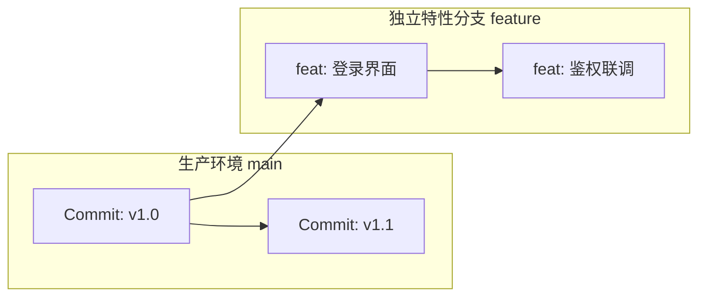
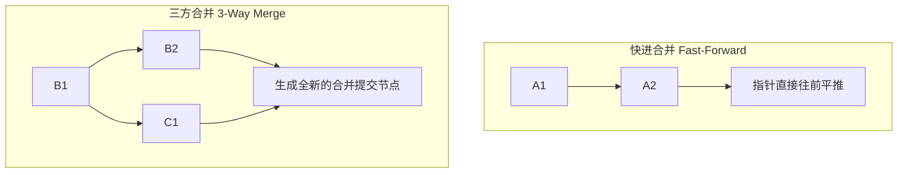

<div class="pt-2 mb-2">
  <h1 class="!border-none !mb-0 text-3xl font-bold">20｜为什么必须使用 Branch（分支）？</h1>
  <p class="text-xs text-gray-400 mt-1">软件工程铁律：绝不要直接在 <code>main</code> 主分支上写业务开发代码！</p>
</div>

<div class="grid grid-cols-2 gap-8 my-auto">

<div class="space-y-4 flex flex-col justify-center">

<div class="p-5 bg-white/5 border border-white/10 rounded-2xl space-y-2">
  <h3 class="text-base font-bold text-blue-400">主线保护与并行隔离</h3>
  <ul class="space-y-2 text-xs text-gray-300 leading-relaxed">
    <li>• <strong><code>main</code> 分支神圣不可侵犯</strong>：永远代表当前最稳定的生产环境代码，随时可打 Tag 部署发版。</li>
    <li>• <strong>多功能并行无干扰</strong>：
      <div class="pl-2 space-y-1 mt-1 text-gray-400">
        <div>- 同事 A 研发复杂重构（需 5 天）</div>
        <div>- 同事 B 紧急修复支付 Bug（需 10 分钟）</div>
        <div>- 两人各自在独立分支作业，完全互不影响！</div>
      </div>
    </li>
  </ul>
</div>

</div>

<div class="p-6 bg-gray-500/10 border border-gray-500/20 rounded-2xl flex flex-col justify-between space-y-4">

<h3 class="text-base font-bold">分支演进拓扑模型</h3>



<div class="p-3.5 bg-blue-500/10 border border-blue-500/20 text-xs rounded-xl text-blue-300 leading-relaxed">
  <strong>廉价轻量的 Git 分支</strong>：在 Git 中，创建一个分支只是新建了一个 41 字节的指针文件，创建与切换都是<strong>瞬间完成（几毫秒）</strong>，与庞大的文件复制有天壤之别！
</div>

</div>

</div>

---
layout: default
class: flex flex-col h-full
---

<div class="pt-2 mb-2">
  <h1 class="!border-none !mb-0 text-3xl font-bold">21｜创建与切换分支：拥抱现代命令</h1>
</div>

<div class="grid grid-cols-2 gap-8 my-auto">

<div class="space-y-4 flex flex-col justify-center">

<h3 class="text-base font-bold text-blue-400">全面采用语义化新指令：`git switch`</h3>

```bash
# 1. 查看本地所有分支 (* 号标识当前所在位置)
git branch

# 2. 一键创建并立即切入新功能分支 (推荐实践)
git switch -c feature/user-profile
# 等同于旧版语法: git checkout -b feature/user-profile

# 3. 随时平滑切换回主干分支
git switch main
```

<div class="p-3 bg-white/5 border border-white/10 rounded-xl text-xs text-gray-400">
历史命令 <code>checkout</code> 职责混杂（既切分支又还原文件），Git 2.23+ 拆分出了专注于分支的 <code>switch</code>。
</div>

</div>

<div class="p-6 bg-gray-500/10 border border-gray-500/20 rounded-2xl flex flex-col justify-between space-y-3">

<h3 class="text-base font-bold text-purple-400">团队分支规范化命名体系</h3>

<table class="w-full text-xs border-collapse">
  <thead>
    <tr class="border-b border-gray-700 text-gray-400">
      <th class="py-2 text-left">前缀类别</th>
      <th class="py-2 text-left">应用场景与范例</th>
    </tr>
  </thead>
  <tbody class="divide-y divide-gray-800 text-gray-300">
    <tr>
      <td class="py-2 font-mono text-green-400">feature/</td>
      <td class="py-2">日常新业务特性：<code>feature/oauth2-login</code></td>
    </tr>
    <tr>
      <td class="py-2 font-mono text-yellow-400">fix/</td>
      <td class="py-2">常规缺陷 Bug 修复：<code>fix/date-picker-null</code></td>
    </tr>
    <tr>
      <td class="py-2 font-mono text-red-400">hotfix/</td>
      <td class="py-2">线上突发重大致命补丁：<code>hotfix/pay-crash</code></td>
    </tr>
    <tr>
      <td class="py-2 font-mono text-purple-400">refactor/</td>
      <td class="py-2">纯代码架构重构：<code>refactor/api-client</code></td>
    </tr>
  </tbody>
</table>

<div class="text-xs pt-1">
  清晰的前缀让所有团队成员对当前任务属性与紧急度一目了然。
</div>

</div>

</div>

---
layout: default
class: flex flex-col h-full
---

<div class="pt-2 mb-2">
  <h1 class="!border-none !mb-0 text-3xl font-bold">22｜一个真实团队的多人协作模型</h1>
  <p class="text-xs text-gray-400 mt-1">主干稳定、分支隔离、线上热修与平滑汇入的标准全流程</p>
</div>

<div class="my-auto space-y-4">

<div class="p-3 bg-gray-50/80 border border-gray-200 rounded-2xl">
  <GitTeamGraph />
</div>

<div class="grid grid-cols-3 gap-4 text-xs text-center">
  <div class="p-3 bg-blue-500/10 border border-blue-500/30 rounded-xl">
    <div class="font-bold text-blue-400 mb-0.5">1. 主分支保持发布</div>
    <div class="opacity-75">随时能拉出热修复分支</div>
  </div>
  <div class="p-3 bg-red-500/10 border border-red-500/30 rounded-xl">
    <div class="font-bold text-red-400 mb-0.5">2. 线上紧急打补丁</div>
    <div class="opacity-75">修完打 Tag 并同步给功能分支</div>
  </div>
  <div class="p-3 bg-green-500/10 border border-green-500/30 rounded-xl">
    <div class="font-bold text-green-400 mb-0.5">3. 功能特性平滑合入</div>
    <div class="opacity-75">集成测试完全通过后打大版本</div>
  </div>
</div>

</div>

---
layout: default
class: flex flex-col h-full
---

<div class="pt-2 mb-2">
  <h1 class="!border-none !mb-0 text-3xl font-bold">23｜'git merge'：分支代码合并</h1>
</div>

<div class="grid grid-cols-2 gap-8 my-auto">

<div class="space-y-4 flex flex-col justify-center">

<h3 class="text-base font-bold text-blue-400">将已验证功能分支安全汇入目标分支</h3>

```bash
# 1. 切换到准备接收改动的分支
git switch main

# 2. 关键前置：先同步远程最新的主分支
git pull origin main

# 3. 将你的特性分支合并进来
git merge feature/user-profile

# 4. 合并完成且测试通过后，清理已废弃分支
git branch -d feature/user-profile
```

</div>

<div class="p-6 bg-gray-500/10 border border-gray-500/20 rounded-2xl flex flex-col justify-between space-y-4">

<h3 class="text-base font-bold">两种核心合并模式图解</h3>



<div class="p-3.5 bg-yellow-500/10 border border-yellow-500/30 text-xs rounded-xl leading-relaxed">
  <strong>团队规约</strong>：合并进主干时，团队通常禁用快进合并（<code>git merge --no-ff</code>），显式保留特性分支的生命周期与拓扑节点。
</div>

</div>

</div>

---
layout: default
class: flex flex-col h-full
---

<div class="pt-2 mb-2">
  <h1 class="!border-none !mb-0 text-3xl font-bold">24｜Merge Conflict：代码冲突处理实操</h1>
  <p class="text-xs text-gray-400 mt-1">当多个人修改了同一个文件的同一行或相邻代码时，Git 触发人工裁决冲突机制</p>
</div>

<div class="grid grid-cols-2 gap-8 my-auto">

<div class="space-y-4 flex flex-col justify-center">

<h3 class="text-base font-bold text-red-400">1. 源码中的冲突标记解剖</h3>

```diff
<<<<<<< HEAD (你当前所在分支的代码)
const API_URL = "https://api.prod.company.com/v1";
const TIMEOUT = 5000;
=======
const API_URL = "https://api.prod.company.com/v2";
const TIMEOUT = 8000;
>>>>>>> feature/new-api (尝试合入的分支代码)
```

<div class="p-3 bg-white/5 border border-white/10 rounded-xl text-xs space-y-1 text-gray-300">
  <div>• <code>&lt;&lt;&lt;&lt;&lt;&lt;&lt; HEAD</code>：你本地当前的代码版本。</div>
  <div>• <code>=======</code>：中间分割线。</div>
  <div>• <code>&gt;&gt;&gt;&gt;&gt;&gt;&gt; branch</code>：对方传入的代码版本。</div>
</div>

</div>

<div class="p-6 bg-gray-500/10 border border-gray-500/20 rounded-2xl flex flex-col justify-between space-y-3">

<h3 class="text-base font-bold text-green-400">2. 规范解决冲突标准三步法</h3>

<div class="space-y-3 text-xs">

<div class="p-3 bg-blue-500/15 border border-blue-500/25 rounded-xl">
  <strong class="text-blue-300">第 1 步：人工裁决代码</strong><br/>
  在 VS Code 中点击“保留当前”或“保留传入”，或者结合两者；手动删除所有 <code>&lt;&lt;&lt;</code>、<code>===</code>、<code>&gt;&gt;&gt;</code> 标记。
</div>

<div class="p-3 bg-yellow-500/15 border border-yellow-500/25 rounded-xl">
  <strong class="text-yellow-300">第 2 步：标记冲突已解决</strong><br/>
  保存文件后，重新执行暂存：<br/>
  <code>git add &lt;resolved-file&gt;</code>
</div>

<div class="p-3 bg-emerald-500/15 border border-emerald-500/25 rounded-xl">
  <strong class="text-emerald-600">第 3 步：完成合并提交</strong><br/>
  <code>git commit -m "fix: resolve merge conflict in config"</code>
</div>

</div>

</div>

</div>
