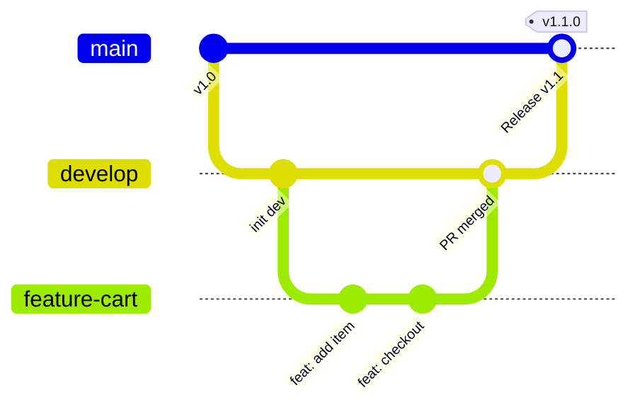

<div class="pt-2 mb-2">
  <h1 class="!border-none !mb-0 text-3xl font-bold">31｜团队标准 Git 工作流规范</h1>
  <p class="text-xs text-gray-400 mt-1">中大型工程化团队普遍遵循的特性分支工作流（Feature Branch Workflow）</p>
</div>

<div class="my-auto space-y-4">

<div class="p-4 bg-black/20 border border-gray-800 rounded-2xl">

</div>

<div class="grid grid-cols-4 gap-4 text-xs text-center">
  <div class="p-3 bg-blue-500/10 border border-blue-500/30 rounded-xl">
    <div class="font-bold text-blue-400 mb-0.5">main</div>
    <div class="opacity-75">线上生产环境稳定基线</div>
  </div>
  <div class="p-3 bg-yellow-500/10 border border-yellow-500/30 rounded-xl">
    <div class="font-bold text-yellow-400 mb-0.5">develop</div>
    <div class="opacity-75">日常开发集成分支</div>
  </div>
  <div class="p-3 bg-green-500/10 border border-green-500/30 rounded-xl">
    <div class="font-bold text-green-400 mb-0.5">feature/*</div>
    <div class="opacity-75">具体业务功能隔离开发</div>
  </div>
  <div class="p-3 bg-red-500/10 border border-red-500/30 rounded-xl">
    <div class="font-bold text-red-400 mb-0.5">hotfix/*</div>
    <div class="opacity-75">线上紧急致命漏洞修复</div>
  </div>
</div>

</div>

---
layout: default
class: flex flex-col h-full
---

<div class="pt-2 mb-2">
  <h1 class="!border-none !mb-0 text-3xl font-bold">32｜`.gitignore` 规范：坚决不进版本库的文件</h1>
  <p class="text-xs text-gray-400 mt-1">只跟踪与业务逻辑相关的源文件，坚决将临时缓存、虚拟环境与构建产物挡在门外</p>
</div>

<div class="grid grid-cols-2 gap-8 my-auto">

<div class="space-y-2">

<h3 class="text-sm font-bold text-blue-400">前端工程标准配置示例</h3>

```bash
# 依赖包（体积巨大，随时可通过 install 重新生成）
node_modules/
.pnpm-store/

# 生产环境编译产物输出目录
dist/
build/

# 本地个人环境变量与本地密钥配置
.env.local
.env.*.local

# 本地编辑器生成与操作系统临时文件
.vscode/*
!.vscode/settings.json
.DS_Store
*.log
```

</div>

<div class="space-y-2">

<h3 class="text-sm font-bold text-green-400">Python 工程标准配置示例</h3>

```bash
# Python 解释器编译字节码与缓存
__pycache__/
*.py[cod]
*$py.class

# 本地 Python 虚拟环境目录
.venv/
env/
venv/
ENV/

# 包构建分发生成的归档产物
build/
dist/
*.egg-info/

# 运行时临时日志与自动化测试覆盖率缓存
*.log
.pytest_cache/
.coverage
```

</div>

</div>

---
layout: default
class: flex flex-col h-full
---

<div class="pt-2 mb-2">
  <h1 class="!border-none !mb-0 text-3xl font-bold">33｜GitHub 安全底线：严禁提交这些！</h1>
</div>

<div class="my-auto space-y-4">

<div class="p-5 bg-red-500/15 border-2 border-red-500/40 rounded-2xl">
  <div class="text-base font-bold text-red-400 mb-1 flex items-center gap-2">
    <svg class="w-5 h-5" viewBox="0 0 24 24" fill="none" stroke="currentColor" stroke-width="2"><path d="M10.29 3.86L1.82 18a2 2 0 0 0 1.71 3h16.94a2 2 0 0 0 1.71-3L13.71 3.86a2 2 0 0 0-3.42 0z"/><line x1="12" y1="9" x2="12" y2="13"/><line x1="12" y1="17" x2="12.01" y2="17"/></svg>
    <span>警惕全球爬虫全天候毫秒级监控！</span>
  </div>
  <p class="text-xs text-gray-300 leading-relaxed">
    GitHub 上的所有公开仓库都面临全网黑产爬虫的不间断监控。一旦你将敏感凭据通过 <code>git push</code> 发送至公网，几秒钟内云主机就会沦为挖矿肉鸡，巨额账单纷至沓来！
  </p>
</div>

<div class="grid grid-cols-4 gap-4 text-xs">

<div class="p-4 bg-gray-500/10 border border-gray-500/20 rounded-xl space-y-1">
  <div class="font-bold text-red-400 flex items-center gap-1.5 text-sm">
    <svg class="w-4 h-4" viewBox="0 0 24 24" fill="none" stroke="currentColor" stroke-width="2"><path d="M21 2l-2 2m-2-2l2 2m7 0a9 9 0 1 1-18 0 9 9 0 0 1 18 0z"/><path d="M15.5 8.5l1 1"/><path d="M19 5l-4 4"/></svg>
    <span>云厂商核心密钥</span>
  </div>
  <p class="text-gray-400 leading-relaxed">阿里云 / 腾讯云 / AWS 的 AccessKey 与 SecretKey 证书</p>
</div>

<div class="p-4 bg-gray-500/10 border border-gray-500/20 rounded-xl space-y-1">
  <div class="font-bold text-red-400 flex items-center gap-1.5 text-sm">
    <svg class="w-4 h-4" viewBox="0 0 24 24" fill="none" stroke="currentColor" stroke-width="2"><ellipse cx="12" cy="5" rx="9" ry="3"/><path d="M21 12c0 1.66-4 3-9 3s-9-1.34-9-3"/><path d="M3 5v14c0 1.66 4 3 9 3s9-1.34 9-3V5"/></svg>
    <span>数据库连接凭据</span>
  </div>
  <p class="text-gray-400 leading-relaxed">包含明文用户名、密码、生产库 IP 的 JDBC/URL 连接串</p>
</div>

<div class="p-4 bg-gray-500/10 border border-gray-500/20 rounded-xl space-y-1">
  <div class="font-bold text-red-400 flex items-center gap-1.5 text-sm">
    <svg class="w-4 h-4" viewBox="0 0 24 24" fill="none" stroke="currentColor" stroke-width="2"><rect x="3" y="11" width="18" height="11" rx="2" ry="2"/><path d="M7 11V7a5 5 0 0 1 10 0v4"/></svg>
    <span>AI 与三方 Token</span>
  </div>
  <p class="text-gray-400 leading-relaxed">OpenAI API Key、企业微信凭证、GitHub Personal Token</p>
</div>

<div class="p-4 bg-gray-500/10 border border-gray-500/20 rounded-xl space-y-1">
  <div class="font-bold text-red-400 flex items-center gap-1.5 text-sm">
    <svg class="w-4 h-4" viewBox="0 0 24 24" fill="none" stroke="currentColor" stroke-width="2"><path d="M12 22s8-4 8-10V5l-8-3-8 3v7c0 6 8 10 8 10z"/></svg>
    <span>SSH 私钥与 SSL 证书</span>
  </div>
  <p class="text-gray-400 leading-relaxed"><code>id_rsa</code> 私钥文件、支付商户签名证书（<code>.p12</code>, <code>.pem</code>）</p>
</div>

</div>

<div class="p-3 bg-blue-500/10 border border-blue-500/20 text-xs rounded-xl text-center flex items-center justify-center gap-2 text-blue-200">
  <svg class="w-4 h-4 shrink-0" viewBox="0 0 24 24" fill="none" stroke="currentColor" stroke-width="2"><circle cx="12" cy="12" r="10"/><line x1="12" y1="16" x2="12" y2="12"/><line x1="12" y1="8" x2="12.01" y2="8"/></svg>
  <span><strong>危机补救</strong>：若不幸误提交，仅在本地新提交删掉文件是毫无意义的（历史快照中依然可查）！必须<strong>立即登录控制台吊销并重置该密钥</strong>！</span>
</div>

</div>

---
layout: default
class: flex flex-col h-full
---

<div class="pt-2 mb-2">
  <h1 class="!border-none !mb-0 text-3xl font-bold">34｜常用 Git 命令高频速查宝典</h1>
  <p class="text-xs text-gray-400 mt-1">覆盖 95% 以上日常研发场景的核心操作速查清单</p>
</div>

<div class="grid grid-cols-3 gap-6 text-xs my-auto">

<div class="p-4 bg-white/5 border border-white/10 rounded-2xl space-y-4 flex flex-col justify-between">
  <div>
    <h3 class="flex items-center gap-2 mb-2 font-bold text-blue-400">
      <svg class="w-4 h-4" viewBox="0 0 24 24" fill="none" stroke="currentColor" stroke-width="2"><polyline points="4 17 10 11 4 5"/><line x1="12" y1="19" x2="20" y2="19"/></svg>
      <span>仓库生命期与状态</span>
    </h3>
    <ul class="space-y-1.5 text-gray-300">
      <li>• <code>git init</code>：初始化当前为仓库</li>
      <li>• <code>git clone &lt;url&gt;</code>：克隆远程仓库</li>
      <li>• <code>git status</code>：查验工作区状态</li>
      <li>• <code>git log --oneline --graph</code>：图形树</li>
    </ul>
    <h3 class="flex items-center gap-2 mt-4 mb-2 font-bold text-green-400">
      <svg class="w-4 h-4" viewBox="0 0 24 24" fill="none" stroke="currentColor" stroke-width="2"><circle cx="12" cy="12" r="4"/><line x1="1.05" y1="12" x2="7" y2="12"/><line x1="17.01" y1="12" x2="22.96" y2="12"/></svg>
      <span>暂存与原子提交</span>
    </h3>
    <ul class="space-y-1.5 text-gray-300">
      <li>• <code>git add &lt;file&gt;</code>：精准挑选暂存</li>
      <li>• <code>git add .</code>：暂存所有变更</li>
      <li>• <code>git commit -m "msg"</code>：提交快照</li>
      <li>• <code>git commit --amend</code>：追加上次</li>
    </ul>
  </div>
</div>

<div class="p-4 bg-white/5 border border-white/10 rounded-2xl space-y-4 flex flex-col justify-between">
  <div>
    <h3 class="flex items-center gap-2 mb-2 font-bold text-purple-400">
      <svg class="w-4 h-4" viewBox="0 0 24 24" fill="none" stroke="currentColor" stroke-width="2"><line x1="6" y1="3" x2="6" y2="15"/><circle cx="18" cy="6" r="3"/><circle cx="6" cy="18" r="3"/><path d="M18 9a9 9 0 0 1-9 9"/></svg>
      <span>分支管理与流转</span>
    </h3>
    <ul class="space-y-1.5 text-gray-300">
      <li>• <code>git branch</code>：列出本地分支</li>
      <li>• <code>git switch &lt;branch&gt;</code>：平滑切分支</li>
      <li>• <code>git switch -c &lt;new&gt;</code>：创建并切入</li>
      <li>• <code>git merge &lt;branch&gt;</code>：合并指定分支</li>
      <li>• <code>git branch -d &lt;branch&gt;</code>：删除分支</li>
    </ul>
    <h3 class="flex items-center gap-2 mt-4 mb-2 font-bold text-yellow-400">
      <svg class="w-4 h-4" viewBox="0 0 24 24" fill="none" stroke="currentColor" stroke-width="2"><circle cx="12" cy="12" r="10"/><line x1="2" y1="12" x2="22" y2="12"/><path d="M12 2a15.3 15.3 0 0 1 4 10 15.3 15.3 0 0 1-4 10 15.3 15.3 0 0 1-4-10 15.3 15.3 0 0 1 4-10z"/></svg>
      <span>远程同步</span>
    </h3>
    <ul class="space-y-1.5 text-gray-300">
      <li>• <code>git remote -v</code>：查看关联云端</li>
      <li>• <code>git fetch</code>：只抓取远程更新</li>
      <li>• <code>git pull</code>：抓取并自动合入</li>
      <li>• <code>git push -u origin &lt;br&gt;</code>：首次绑定</li>
    </ul>
  </div>
</div>

<div class="p-4 bg-white/5 border border-white/10 rounded-2xl space-y-4 flex flex-col justify-between">
  <div>
    <h3 class="flex items-center gap-2 mb-2 font-bold text-pink-400">
      <svg class="w-4 h-4" viewBox="0 0 24 24" fill="none" stroke="currentColor" stroke-width="2"><polyline points="1 4 1 10 7 10"/><path d="M3.51 15a9 9 0 1 0 2.13-9.36L1 10"/></svg>
      <span>撤销与工程后悔药</span>
    </h3>
    <ul class="space-y-1.5 text-gray-300">
      <li>• <code>git restore &lt;file&gt;</code>：抛弃工作区改动</li>
      <li>• <code>git restore --staged &lt;file&gt;</code>：从暂存区撤回</li>
      <li>• <code>git reset --soft HEAD~1</code>：撤回提交保留暂存</li>
      <li>• <code>git stash</code>：半成品代码压入临时工作栈</li>
      <li>• <code>git stash pop</code>：弹出恢复临时暂存</li>
    </ul>
  </div>

  <div class="p-2.5 bg-blue-500/10 border border-blue-500/20 rounded-xl text-blue-300">
    建议结合 VS Code 内置图形化 Git 树直观审查 Diff
  </div>
</div>

</div>

---
layout: center
class: text-center flex flex-col h-full justify-center
---

<div class="my-auto space-y-6">

<h1 class="!border-none text-4xl font-extrabold tracking-tight text-white mb-2">
  35｜从 GitHub 消费者到开源协作者
</h1>

<div class="max-w-2xl mx-auto p-6 bg-white/5 border border-white/10 rounded-2xl text-left text-xs space-y-3">
  <h3 class="text-sm font-bold text-blue-400 flex items-center gap-2">
    <svg class="w-4 h-4" viewBox="0 0 24 24" fill="none" stroke="currentColor" stroke-width="2"><polyline points="23 4 23 10 17 10"/><polyline points="1 20 1 14 7 14"/><path d="M3.51 9a9 9 0 0 1 14.85-3.36L23 10M1 14l4.64 4.36A9 9 0 0 0 20.49 15"/></svg>
    <span>现代化研发完整闭环</span>
  </h3>
  <p class="text-gray-300 leading-relaxed">
    <code>挑选优质开源项目</code> $\rightarrow$ <code>阅读 README / License</code> $\rightarrow$ <code>Clone / Fork 本地跑通</code>  
    $\rightarrow$ <code>创建 Branch 隔离开发</code> $\rightarrow$ <code>规范化 Commit Message</code> $\rightarrow$ <code>Push 到个人远端</code>  
    $\rightarrow$ <code>发起 Pull Request</code> $\rightarrow$ <code>同行 Code Review 交流</code> $\rightarrow$ <code>合入主干交付价值</code>
  </p>
</div>

<div class="text-2xl font-serif italic text-blue-400 pt-2">
  “Git 让你的代码拥有历史，GitHub 让你的代码连接世界。”
</div>

<div class="text-sm text-gray-400">
  感谢大家的聆听！期待在 GitHub 上见证你的第一个开源 PR！
</div>

</div>
